# Windows Server 💻

Esses componentes formam a base sólida para a infraestrutura de TI, proporcionando gerenciamento centralizado, distribuição dinâmica de endereços IP, virtualização e resoluções eficientes.

* [Hyper-V](#Virtualização-com-Hyper-V)
* [Windows Server](#Instalação-e-Configuração-do-Windows-Server)
* [Active Directory](#Configuração-do-Active-Directory)
* [DHCP](#Implantação-do-Serviço-DHCP)
* [DNS](#Instalação-e-Configuração-do-Windows-Server)

## Virtualização com Hyper-V:

* O Hyper-V é uma plataforma de virtualização da Microsoft que permite a criação e gerenciamento de máquinas virtuais em servidores Windows, proporcionando eficiência, isolamento e flexibilidade de recursos.

* Você pode baixar o Hyper-V através do PowerShell com permissões administrativas usando o comando:
  
  * `Enable-WindowsOptionalFeature -Online -FeatureName Microsoft-Hyper-V -All`
 
* Trocando o nome do servidor:
  
  * Meu Computador -> Propriedades -> Renomear este Computador -> Reinicie a máquina
  
   * 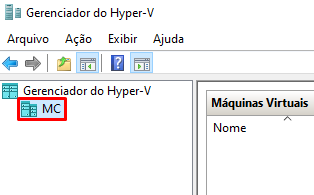
 
### Comutadores Virtuais (Virtual Switches):
* Eles permitem a comunicação entre maquinas virtuais e/ou com redes físicas, facilitando a criação e gerenciamento de redes virtuais em ambientes de virtualização.

  * 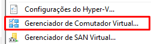
  
* Tipos de Comutadores:
  
  * External Switch - Permite que máquinas virtuais se comuniquem com redes físicas e outros dispositivos fora do ambiente virtual.
    
  * Internal Switch - É utilizado para comunicação exclusiva entre máquinas virtuais em um host específico, mas não têm acesso direto à rede física externa.
    
  * Private Switch - É semelhante ao interno, mas não permite qualquer comunicação com a rede física externa. Ele cria uma rede isolada apenas para as VMs no host.

### Criando e Configurando a Primeira Máquina Virtual

*  Você vai precisar de uma [ISO Windows Server](https://www.microsoft.com/en-us/software-download/windowsinsiderpreviewserver?wa=wsignin1.0)

  * 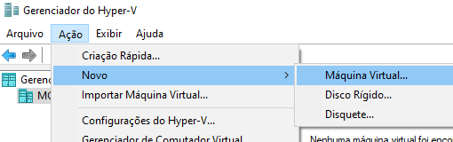

* Após criar uma máquina virtual no Hyper-V, você ainda pode ajustar várias configurações para atender às suas necessidades:
  
  * Processador: Ajustar o número de processadores virtuais alocados à VM.
    
  * Memória: Modificar a quantidade de RAM atribuída à VM.
    
  * Dispositivos de Inicialização: Alterar a ordem de inicialização e selecionar discos virtuais ou outros dispositivos.
    
  * Rede: Modificar a configuração de rede associada à VM, como trocar o switch virtual ao qual a VM está conectada.
    
  * Armazenamento: Adicionar, remover ou modificar discos virtuais, além de ajustar configurações avançadas, como snapshots.
    
  * Integração com Serviços: Habilitar ou desabilitar a integração com serviços, como a integração do sistema operacional convidado, cópia e cola, e redirecionamento de área de transferência.
    
  * Configurações de Segurança: Modificar configurações de segurança, como habilitar ou desabilitar o "Secure Boot" ou configurar políticas de máquinas virtuais protegidas.
    
  * Geração da Máquina Virtual: Em algumas versões do Hyper-V, você pode converter uma VM de uma geração para outra.

## Instalação e Configuração do Windows Server:

### Instalando o Windows Server

  * 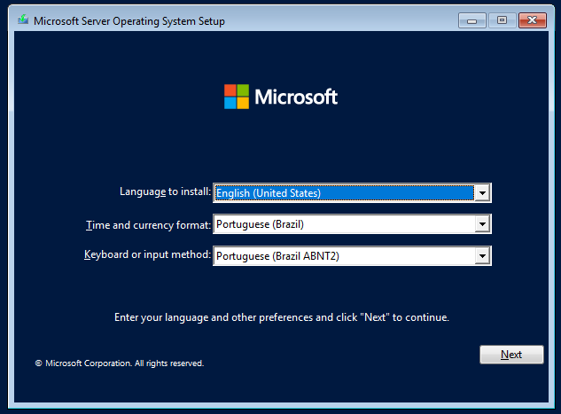

* Após a instalação do sistema operacional, você terá acesso ao Gerenciador do Servidor.

  * O Gerenciador do Servidor é uma ferramenta que oferece uma interface centralizada para configurar, gerenciar e monitorar várias funções e recursos em um servidor. Ele facilita a administração do servidor, especialmente em ambientes onde múltiplas funções e serviços estão em execução.

  * 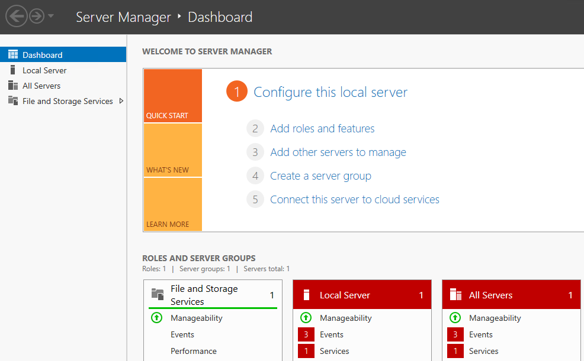

* Alterar o nome do servidor no Server Manager pode ser necessário para seguir padrões de nomenclatura, ajustar à reestruturação da rede, manter a consistência, resolver conflitos de nomes, atender a políticas de segurança e compliance, ou refletir mudanças na infraestrutura e hardware.

* 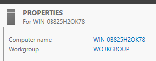

### Configurando o Ip da Máquina Virtual

* A utilização de IPs fixos em máquinas virtuais proporciona estabilidade na configuração, facilita a identificação e a acessibilidade consistente, além de simplificar a administração, integração com redes locais e evitar conflitos de IP.

  * 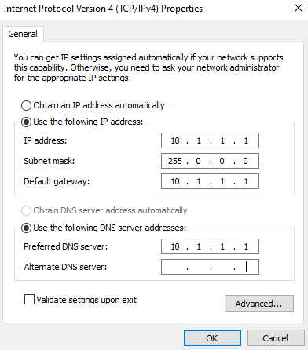

### Atualizando com Windows Update

* Manter o Server Manager atualizado é essencial para segurança, estabilidade e desempenho, com correções de segurança, melhorias e suporte a novos recursos, assegurando uma gestão eficiente da infraestrutura Windows.

  * 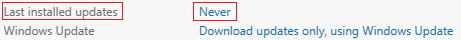

### Configurando o Servidor Local a Controlador de Domínio

* No Dashboard do Server Manager, clique em "Adicionar Funções e Recursos" e siga o assistente de instalação.

  * 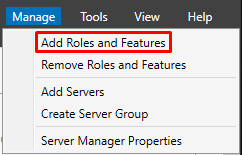

* Selecione "Serviços de Domínio Active Directory" e adicione as ferramentas de administração se desejar.

  * 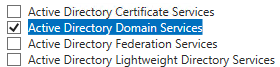

* Após a instalação do AD DS, clique em "Promover este servidor a um controlador de domínio" na notificação ou acesse isso através da guia "Gerenciar" no Server Manager.

  * 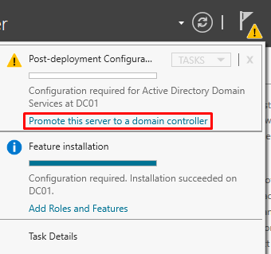

* Insira o nome do domínio raiz, escolha o nível funcional do domínio e da floresta e defina a senha do Modo de Restauração de Serviço.

  * 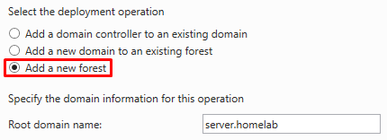

* Revise as configurações, corrija qualquer problema e clique em "Instalar" para iniciar a promoção do servidor.

  * 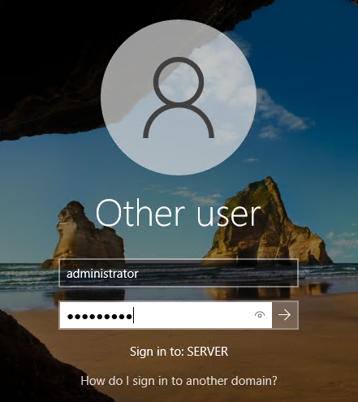

* Você também pode promover um servidor local a controlador de domínio através do PowerShell com os seguintes comandos:

* ` Import-Module ADDSDeployment `
  ` Install -ADDSForest ` 
  ` -CreateDnsDelegation:$false `
  ` -DatabasePath "C:\Windows\NTDS" `
  ` -DomainMode "winThreshold" `
  ` -DomainName "server.homelab" `
  ` -DomainNetbiosName "SERVER" `
  ` -ForestMode "WinThreshold" `
  ` -InstallDns:$true `
  ` -LogPath "C:\Windows\NTDS" `
  ` -NoRebootOnCompletion:$false ` 
  ` -SysvolPath "C:\Windows\SYSVOL" `
  ` -Force:$true `
  

## Configuração do Active Directory:

* O Active Directory é essencial para a administração centralizada de identidades, autenticação segura, aplicação de políticas, gestão de recursos e segurança em ambientes Windows, contribuindo para a eficiência e integridade da infraestrutura de TI. Você pode acessá-lo através dessas opções, dentro do Dashboard do Server Manager:

  * 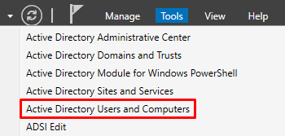

* No Active Directory, as pastas são contêineres importantes para a organização de objetos e grupos dentro do diretório. Vamos explorar cada uma dessas pastas:

   * 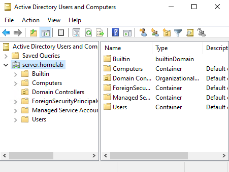

* Builtin:

  * A pasta "Builtin" contém grupos predefinidos do sistema que fornecem permissões e direitos especiais em todo o domínio. Exemplos incluem grupos como "Administradores", "Usuários", etc.
  
* Computers:

  * A pasta "Computers" armazena objetos de computadores no domínio. Cada objeto representa uma máquina ou dispositivo integrado ao domínio.
  
* Domain Controllers:

  * Nesta pasta, estão contidos objetos relacionados aos controladores de domínio. Cada controlador de domínio na rede terá um objeto associado aqui.
  
* ForeignSecurityPrincipals:

  * Esta pasta mantém informações sobre objetos de segurança de domínios confiáveis externos. Por exemplo, quando um trust (relação de confiança) é estabelecido com outro domínio, os objetos de segurança desse domínio aparecem aqui.
  
* Users:

  * A pasta "Users" é onde os objetos de usuário são armazenados. Cada usuário no domínio é representado por um objeto dentro desta pasta. Esses objetos contêm informações como nome, senha, permissões e atributos adicionais do usuário.

## Implantação do Serviço DHCP:
